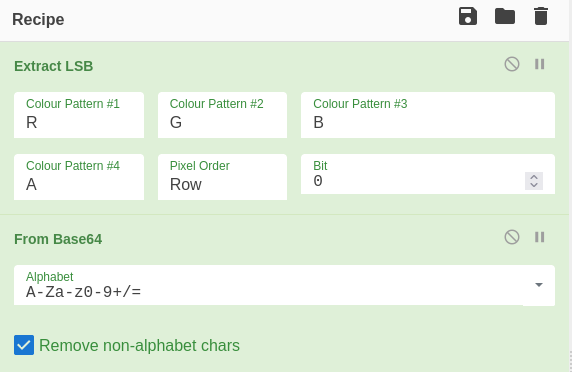

> Goal: a 128 by 128 image of a solid red square, 796 bytes, and nothing visible in it.

## Approach

Looking at the image gets you nowhere, so read what is attached to it rather than what is in it. `exiftool` ships with Kali and installs on Debian and Ubuntu as `libimage-exiftool-perl`, and on this file it turns up a field no camera ever wrote.

```bash frame="code" title="Bash" {6,7}
┌──(Idan@Kali)-[~/RED]
└─> wget https://challenge-files.picoctf.net/c_verbal_sleep/831307718b34193b288dde31e557484876fb84978b5818e2627e453a54aa9ba6/red.png
┌──(Idan@Kali)-[~/RED]
└─> exiftool red.png
File Size                       : 796 bytes
Color Type                      : RGB with Alpha
Poem                            : Crimson heart, vibrant and bold,.Hearts flutter at your sight..Evenings glow softly red,.Cherries burst with sweet life..Kisses linger with your warmth..Love deep as merlot..Scarlet leaves falling softly,.Bold in every stroke.
```

Seven of those dots are not punctuation. `exiftool` prints control characters as `.` in its default output, so those seven are the line breaks and the poem is eight lines. Read the first letter of each and it says `CHECKLSB`.

That names the technique and most of the recipe is in the output above. LSB means bit 0. `RGB with Alpha` means four channels, so the extraction has to read all four in order. Load the file itself into CyberChef, not a path or a paste, and the Input length should read 796 to match.


*Six settings, five of which the metadata already told you.*

<PasswordReveal term="Flag" password="picoCTF{r3d_1s_th3_ult1m4t3_cur3_f0r_54dn355_}" />

The output is 5888 characters rather than 46, because the flag is in there 128 times over. Any one copy is the answer.

## Why it works

Changing a colour channel's lowest bit moves that sample by one step out of 256, so a red square carrying a full payload and a red square carrying nothing are the same picture to a viewer. The `RGB with Alpha` line is the one that shapes the recipe: four channels rather than three, so a quarter of the payload is living in the channel that carries no colour.

The repetition is not redundancy, it is the shape of the container. One row is 128 pixels of four channels at one bit each, which is 512 bits, or exactly 64 bytes. Base64 turns the 46 character flag into exactly 64 characters. So one row holds precisely one encoded copy of the flag with nothing left over, the author tiled it down all 128 rows, and 128 times 46 is the 5888 characters that come back.
